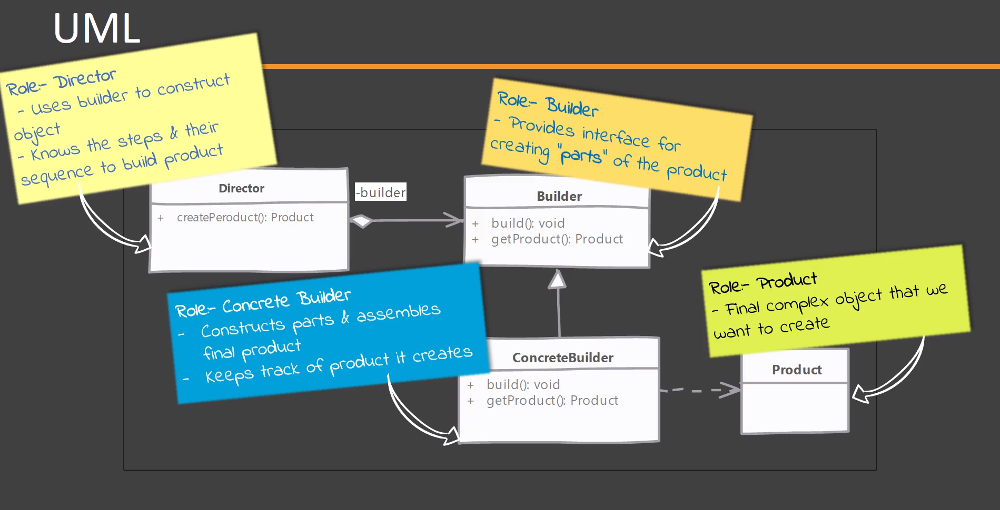

As vezes uma classe pode precisar connhecer todas as dependências de uma vez para ser instânciada, um exemplo são classes que são imutáveis. Passar diversos parâmetros via construtor não é uma boa prática, pode causar diversos problemas.

O padrão **builder** vem pra resolver este problema.

**Quando utilizar?**

1. Quando construir um objeto é uma tarefa complexa que envolve múltiplos passos.
2. Sempre que temos dependências de outras classes no construtor de uma classe, podemos usar o builder para simplificar essa construção de classe.

**Passos para implementar o builder**

1. Identificar partes necessárias para criar o objeto e criar métodos para prover essas partes. Cada parte terá um método no builder para seja possível criar essas partes;
2. Criar um método que monta o objeto final;
3. Prover um modo de pegarmos o objeto final que foi montado.

Director pode ser uma classe separada ou pode ser o próprio cliente que irá montar o objeto. Nesse segundo caso, estariamos dizendo que o cliente sabe como montar nosso objeto.